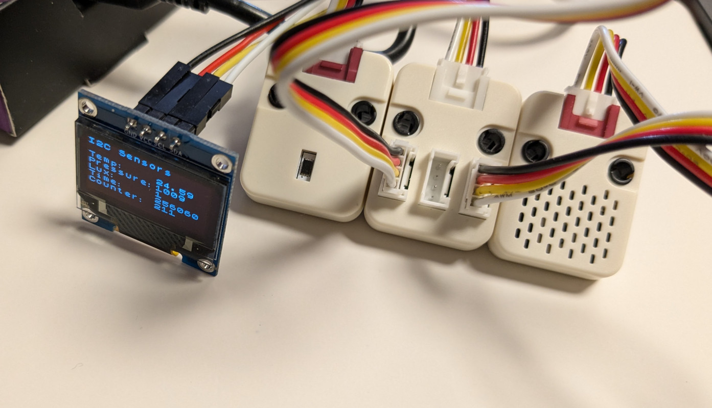

# Embedded Rust and Embassy and a multiple I2C devices and busses

This is an example for a Raspberry Pi Pico with
* 2 I2C busses used
* Both cores used, each one owning one I2C bus
* 1 OLED on one I2C bus
* 2 sensors on the other I2C bus

## Hardware Requirements

* RP2040. I use a Cytron Maker Pi RP2040.
* RPi Pico Probe for downloading and status messages from the RP2040
* I2C SSD1306 OLED display (128x64 pixel)
* BH1750 light sensor and QMP6988 (Temp/Pressure sensor)

## Software Requirements

* Install target compiler:

```
$ rustup target add thumbv6m-none-eabi
```

* To use the Pico probe:

```
$ cargo binstall probe-rs
```

* To use various tools, e.g. to see the code size of the generated ELF (e.g. `cargo size`):

```
$ cargo binstall cargo-binutils
$ cargo size --release
    Finished `release` profile [optimized + debuginfo] target(s) in 0.05s
   text    data     bss     dec     hex filename
  36320       0  103968  140288   22400 rp-bh1750
```

## Running it

The OLED is connected to I2C0 (GPIO 4 and 5). I2C1 is connected to GPIO 2 and 3.

```
$ cargo run --release
   Compiling rp-bh1750 v0.1.0 (/home/harald/src/rust/rp2040/bh1750)
    Finished `release` profile [optimized + debuginfo] target(s) in 1.02s
     Running `probe-rs run --chip RP2040 --protocol swd target/thumbv6m-none-eabi/release/rp-bh1750`
      Erasing ✔ [00:00:00] [##############################################################################] 36.00 KiB/36.00 KiB @ 56.82 KiB/s (eta 0s )
  Programming ✔ [00:00:01] [##############################################################################] 36.00 KiB/36.00 KiB @ 18.67 KiB/s (eta 0s )    Finished in 2.618s
INFO  Hello from core 0
└─ rp_bh1750::__core0_task_task::{async_fn#0} @ src/main.rs:90  
INFO  Hello from core 1
└─ rp_bh1750::__core1_task_task::{async_fn#0} @ src/main.rs:147 
INFO  Light = 96.6666665
└─ rp_bh1750::__core1_task_task::{async_fn#0} @ src/main.rs:205 
INFO  pressure = 1009
└─ rp_bh1750::__core1_task_task::{async_fn#0} @ src/main.rs:187 
INFO  Temperature = 22.911934
...
```


